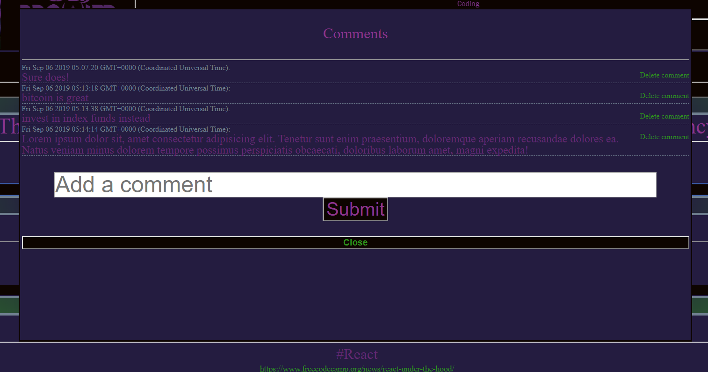

# WebProwler

## Description

This website uses cheerio to scrape Truthdig.com, freeCodeCamp.org/news, and warframe-school.com. Each headline, snippet, and url scraped is added to a mongoDB collection. Users may comment on articles anonymously as well. Any user may delete any comment, too!

Handlebars, vanilla javascript, and CSS Grid/Flexbox were used for the UI.

## Update

Click on this button on any of the three pages to update the page with the latest articles available.

## Article

Each article gets its headline, snippet, and url from mongoDB through Mongoose. There may be no duplicates because each headline has to be unique.

## Comments

Comments are anonymous and only reveal the date in which they were posted. Anyone may delete any comment! The comments collection references the users collection by article IDs, just like a foreign key in SQL.
